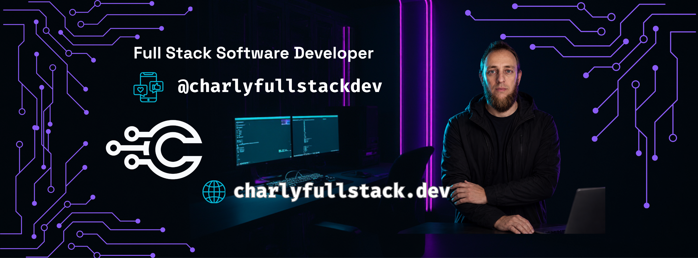

# Carlos Andres Rodriguez @charlyfullstackdev
**Fullstack Software Developer | Tech Entrepreneur | Digital Creator**

> Engineering robust, scalable, and secure digital solutions. Driven by a systemic approach and Agile methodologies, transforming complexity into streamlined, high-performance systems.

## System Architecture & Competencies

I architect technical solutions with an uncompromised focus on logic, security, and market adaptability. My stack operates across front-end rendering, back-end infrastructure, and strategic digital marketing.

### Core Stack & Languages
**JavaScript** | **Python** | **HTML** | **CSS** | **SQL/NoSQL Databases**

### Infrastructure & Security
**Linux** | **Git & GitHub** | **Cybersecurity Fundamentals**

### Methodologies & Management
**Agile / SCRUM** | **UML Modeling** | **Google Workspace Environment** | **Systemic Analysis**

### Frontend Design & A.I.
**UI / UX** | **Minimalist Interface Design** | **Generative A.I. Integrations**

### Professional Capabilities
**Digital Marketing** | **Spanish (Native)** | **English (C1)**

---

## Network & Communications

